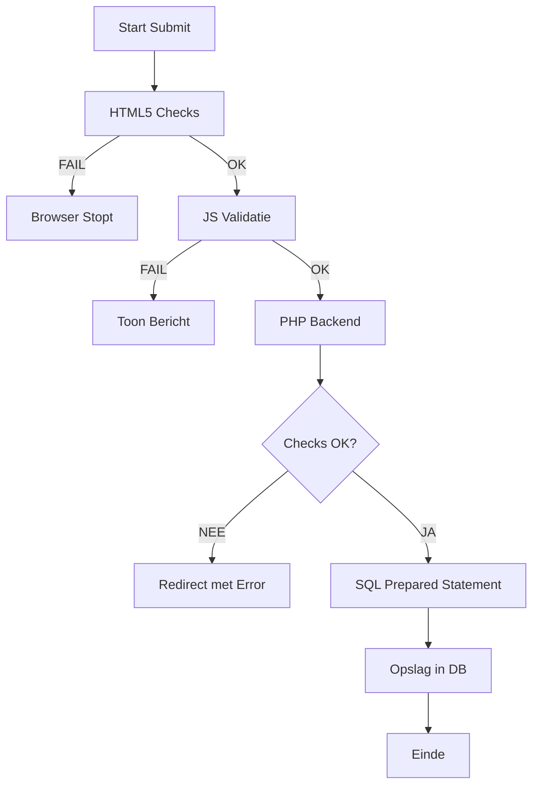

# 🤖 ALGORITMEN & LOGICA (MASTER-EDITIE)
## GamePlan Scheduler - De Technische Hersenen achter de Applicatie

---

> **Auteur**: Harsha Kanaparthi | **Examen**: MBO-4 Software Developer
>
> "Een echte programmeur begrijpt niet alleen de syntax, maar ook de algoritmen die de efficiëntie, veiligheid en stabiliteit van de software bepalen."

---

# 1. Wat is een Algoritme in dit Project?

In de GamePlan Scheduler gebruiken we algoritmen voor drie hoofddoeleinden:
1.  **Validatie**: Beslissen of data de database mag betreden.
2.  **Beveiliging**: Versleutelen en verifiëren van identiteiten.
3.  **Data Management**: Het slim sorteren en koppelen van informatie.

---

# 2. De Kern-Algoritmen (Pseudocode & Logica)

### 2.1 Het "Spatie-Filter" Algoritme (Bugfix #1001)
Voorkomt dat gebruikers de database vervuilen met schijnbaar lege, maar technisch gevulde (spaties) velden.

**Pseudocode:**
```
BEGIN Algoritme_Trim_Check(input)
    1.  NieuweInvoer = VerwijderWitruimte(input) // PHP trim()
    2.  ALS Lengte(NieuweInvoer) == 0 DAN
        RETOURNEER "Fout: Veld is leeg"
    3.  ALS Regex_Match("/^\s*$/", input) DAN
        RETOURNEER "Fout: Alleen spaties niet toegestaan"
    4.  RETOURNEER Succes
EINDE
```

### 2.2 Het Datum-Integriteit Algoritme (Bugfix #1004)
Eenvoudige HTML-datumvelden zijn onveilig. Dit server-side algoritme garandeert 100% correcte data.

**Stappenplan:**
1.  **Input**: Ontvang een string (bijv. "2026-02-30").
2.  **Parsen**: Probeer een `DateTime` object te maken met het formaat `Y-m-d`.
3.  **Consistentie Check**: Vergelijk de input-string met de output van het object. 
    - *Waarom?* PHP corrigeert 30 februari naar 2 maart. Wij blokkeren dit.
4.  **Chronologie**: Check of `GekozenDatum < SysteemDatum`.
5.  **Output**: Blokkeer als de datum in het verleden ligt.

---

# 3. Geavanceerde Database Logica: Normalisatie

Om de database in de **3e Normaalvorm (3NF)** te houden, gebruiken we een slim algoritme bij het toevoegen van spellen.

### 2.3 `getOrCreateGameId()` Algoritme
Voorkomt dat het spel "Fortnite" 100 keer in de database komt te staan.

```php
// De logica in mensentaal:
1. Ontvang de speltitel van de gebruiker.
2. Zoek in de 'Games' tabel of dit spel al bekend is (Case-Insensitive).
3. ALS spel gevonden:
    - Haal het bestaande ID op.
4. ANDERS (Nieuw spel):
    - Voeg de titel toe aan de 'Games' tabel.
    - Haal het zojuist aangemaakte ID op (lastInsertId).
5. Koppel de afspraak aan dit specifieke ID.
```

---

# 4. Authenticatie: De Veiligheids-Loop

Wanneer een gebruiker probeert in te loggen, volgt het systeem dit strikte pad:

### 2.4 Login Algoritme
1.  **Start**: Ontvang email en wachtwoord.
2.  **Lookup**: Doe een `SELECT` query met een `Prepared Statement` op de email.
3.  **Check**: Bestaat de gebruiker? (Zo nee: Stop).
4.  **Hashing**: Vergelijk het ingevoerde wachtwoord met de `password_hash` in de database via `password_verify()`.
5.  **Sessie**: 
    - Indien match: Genereer nieuw Session ID, update `last_activity`.
    - Indien geen match: Toon generieke foutmelding (nooit "Wachtwoord is fout" voor veiligheid).

---

# 5. Het "Soft-Delete" Algoritme (Data-Integriteit)

Wij verwijderen nooit echt rijen uit de database. Dit is een professionele standaard.

**Algoritme:**
- **Actie**: `UPDATE table SET deleted_at = NOW() WHERE id = :id`.
- **Display Logica**: Bij elk overzicht voegen we een filter toe: `WHERE deleted_at IS NULL`.
- **Resultaat**: De gebruiker denkt dat het weg is, maar de data is behouden voor back-ups of herstel.

---

# 6. Beslisboom: Validatie Layers



---

# 7. Conclusie
Door deze documentatie van algoritmen laten we zien dat de GamePlan Scheduler niet "per ongeluk" werkt, maar dat elke functie is doordacht en gebouwd op logica. Dit is de basis van een professionele software architectuur.

---
**GEAUTORISEERD VOOR EXAMEN** - Harsha Kanaparthi
