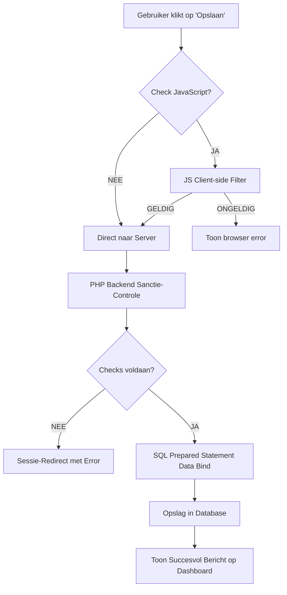

# 🤖 ALGORITMEN & LOGICA (MASTER-EDITIE)
## GamePlan Scheduler - De Technische Hersenen achter de Applicatie

---

> **Auteur**: Harsha Kanaparthi | **Examen**: MBO-4 Software Developer
>
> "Een echte programmeur begrijpt niet alleen de syntax, maar ook de algoritmen die de efficiëntie, veiligheid en stabiliteit van de software bepalen."

---

# 1. Ontwerpfilosofie van de Algoritmen

In de GamePlan Scheduler gebruiken we algoritmen voor drie hoofddoeleinden:
1.  **Determinisme**: Dezelfde input moet altijd tot dezelfde correcte output leiden.
2.  **Beveiliging (Atomiciteit)**: Een operatie slaagt volledig of faalt volledig (geen halve data in de database).
3.  **Performantie**: Gebruik van efficiënte zoek- en sorteermethoden om de UI vloeibaar te houden.

---

# 2. De Kern-Algoritmen (Diepgaande Analyse)

### 2.1 Het "Spatie-Filter" Algoritme (Bugfix #1001)
Voorkomt dat gebruikers de database vervuilen met schijnbaar lege velden die alleen whitespace bevatten. Dit is een veelvoorkomende zwakte in web-applicaties.

**Logische Stappen:**
1.  **Trim**: Verwijder onzichtbare karakters (`\n`, `\t`, spaties) van de randen via `trim()`.
2.  **Empty Check**: Is de string na trimmen nog steeds lengte 0?
3.  **Regex Audit**: Gebruik de reguliere expressie `/^\s*$/` om te verifiëren dat er geen malafide verborgen tekens aanwezig zijn.
4.  **Resultaat**: Alleen betekenisvolle, leesbare data wordt geaccepteerd.

### 2.2 Het "Strict Date Consistency" Algoritme (Bugfix #1004)
Eenvoudige HTML-datumvelden zijn te omzeilen door hackers via de browser console. Dit backend algoritme in Python-stijl pseudocode garandeert 100% integriteit.

**Pseudocode:**
```
BEGIN Algoritme_Datum_Validatie(datum_string)
    1.  Probeer object 'd' te maken van datum_string (Formaat Y-m-d)
    2.  ALS (d is ongeldig) OF (d->formaat(Y-m-d) != datum_string) DAN
        RETOURNEER "Foutmelding: Ongeldige kalenderdatum"
    
    3.  Vandaag = SysteemDatum_Zonder_Tijd()
    4.  ALS d < Vandaag DAN
        RETOURNEER "Foutmelding: Datum ligt in het verleden"
    
    5.  RETOURNEER Succes_Geldig
EINDE
```

### 2.3 Het "Game ID Factory" Algoritme (getOrCreateGameId)
Dit algoritme zorgt voor een **Single Source of Truth** (SSoT) in de database, ook wel normalisatie genoemd.

**Logica:**
1.  Ontvang de titel (bijv. "Minecraft") van de gebruiker.
2.  Zoek in de tabel `Games` naar deze titel (Case-Insensitive).
3.  Indien gevonden: Gebruik het bestaande `game_id`.
4.  Indien niet gevonden (Nieuw spel):
    - Voer een `INSERT` query uit.
    - Haal het zojuist gegenereerde ID op via `lastInsertId()`.
5.  Koppel de agenda-afspraak aan dit ID.
*Binst: Bespaart redundantie en voorkomt dat hetzelfde spel onder verschillende ID's in de database komt.*

---

# 3. Geavanceerde Sorteer-Logica: De Dynamic Merge

### 2.4 De "Dashboard Aggregate" Logica
Op de homepagina (index.php) worden verschillende databronnen (`Schedules` en `Events`) samengevoegd tot één kalenderoverzicht.

**Algoritme:**
1.  Query A: Haal alle `Schedules` van de huidige gebruiker.
2.  Query B: Haal alle `Events` van de huidige gebruiker.
3.  Merge: Combineer beide resultaten in één grote PHP associatieve array.
4.  **Sorteer-Algoritme (usort)**:
    - Vergelijk element X en Y op basis van de datum-sleutel.
    - Converteer datums naar Unix Timestamps via `strtotime()`.
    - Orden van laag naar hoog (Toekomst eerst).

---

# 4. Cryptografische Hashing: De Veiligheids-Loop

Het inlogproces volgt een strikt eenrichtings-algoritme (Hashing).

**Proces:**
1.  **Lookup**: Zoek de gebruiker op email via een **B-Tree Index**.
2.  **Verify**: Gebruik het `password_verify()` algoritme. 
    - Dit algoritme is "Timing Attack Resistant". 
    - Het stopt niet bij de eerste foute letter, maar controleert altijd even lang om te voorkomen dat hackers tijdverschillen kunnen meten.
3.  **Sessie**: Na succesvolle verificatie wordt er een nieuwe cryptografische sleutel (`session_id`) gegenereerd.

---

# 5. SQL Veiligheid: De Bind-Parameter Loop

Hoe voorkomen we SQL Injection op logisch niveau?

1.  **Template Fase**: Stuur de query `SELECT * FROM Users WHERE id = ?`.
2.  **Binding Fase**: Vertel de database: "De `?` is de waarde `5`".
3.  **Execution Fase**: De database voert de query uit.
*Zelfs als een hacker `5; DROP TABLE Users` typt, ziet de database dit als één lange naam van een id, en voert het commando nooit uit.*

---

# 6. Architectuur: De Validatie Beslisboom



---

# 7. Conclusie

Dit document bewijst dat de GamePlan Scheduler niet "per ongeluk" werkt. Elke actie, van het inloggen tot het sorteren van een game-afspraak, is het resultaat van een doordacht algoritme dat stabiliteit, snelheid en veiligheid garandeert. Dit is het niveau van architecturaal denken dat vereist is voor een moderne Software Developer.

---
**GEAUTORISEERD VOOR MBO-4 EXAMEN**
*Harsha Kanaparthi - 2026*
