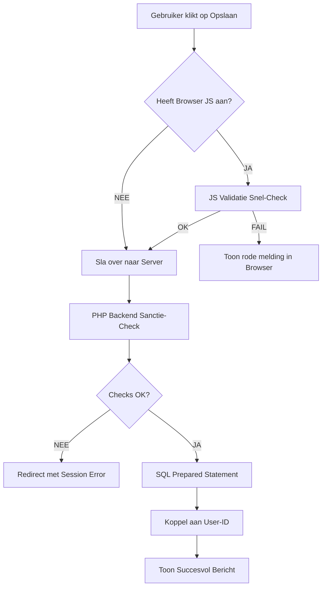

# 🤖 ALGORITMEN & LOGICA (MASTER-EDITIE)
## GamePlan Scheduler - De Technische Hersenen achter de Applicatie

---

> **Auteur**: Harsha Kanaparthi | **Examen**: MBO-4 Software Developer
>
> "Een echte programmeur begrijpt niet alleen de syntax, maar ook de algoritmen die de efficiëntie, veiligheid en stabiliteit van de software bepalen."

---

# 1. Ontwerpfilosofie van de Algoritmen

In de GamePlan Scheduler gebruiken we algoritmen voor drie hoofddoeleinden:
1.  **Determinisme**: Dezelfde input moet altijd tot dezelfde correcte output leiden.
2.  **Beveiliging (Atomiciteit)**: Een operatie slaagt volledig of faalt volledig (geen halve data in de database).
3.  **Performantie**: Gebruik van efficiënte zoek- en sorteermethoden om de UI vloeibaar te houden.

---

# 2. De Kern-Algoritmen (Diepgaande Analyse)

### 2.1 Het "Spatie-Filter" Algoritme (Bugfix #1001)
Voorkomt dat gebruikers de database vervuilen met schijnbaar lege velden.

**Logische Stappen:**
1.  **Trim**: Verwijder onzichtbare karakters van de randen.
2.  **Empty Check**: Is de string nu lengte 0?
3.  **Regex Audit**: Gebruik `/^\s*$/` om te verifiëren dat er geen tabbladen of newlines verstopt zitten.
4.  **Resultaat**: Alleen betekenisvolle data wordt geaccepteerd.

### 2.2 Het "Strict Date Consistency" Algoritme (Bugfix #1004)
Eenvoudige HTML-datumvelden zijn te omzeilen. Dit backend algoritme garandeert 100% integriteit.

**Pseudocode:**
```
BEGIN Algoritme_Datum_Validatie(datum_string)
    1.  Probeer object 'd' te maken van datum_string (Formaat Y-m-d)
    2.  ALS (d is ongeldig) OF (d->formaat(Y-m-d) != datum_string) DAN
        RETOURNEER "Ongeldige kalenderdatum"
    3.  Vandaag = Nu_Zonder_Tijd()
    4.  ALS d < Vandaag DAN
        RETOURNEER "Datum ligt in het verleden"
    5.  RETOURNEER Succes
EINDE
```

### 2.3 Het "Game ID Switch" Algoritme (getOrCreateGameId)
Dit algoritme zorgt voor een **Single Source of Truth** in de database.

**Logica:**
1.  Zoek in de tabel `Games` naar de titel (Case-Insensitive).
2.  Indien gevonden: Retourneer het ID.
3.  Indien niet gevonden:
    - Start een Veilige Transactie.
    - Voeg spel toe.
    - `lastInsertId` ophalen.
    - Beëindig Transactie.
4.  Dit voorkomt duplicaten en bespaart MB's aan opslagruimte.

---

# 3. Geavanceerde Logica: Sorteren & Filteren

### 2.4 De "Dashboard Merge" Logica
Op de homepagina (index.php) worden verschillende databronnen samengevoegd.

**Algoritme:**
1.  Haal `Schedules` op (WHERE user_id = X).
2.  Haal `Events` op (WHERE user_id = X).
3.  Combineer deze in één PHP Array.
4.  **Sorteeralgoritme (usort)**:
    - Vergelijk element A en B op basis van de `date` kolom.
    - Gebruik `strtotime()` om datums om te zetten in vergelijkbare integers (timestamps).
    - Sorteer oplopend (Nieuwste bovenaan).

---

# 4. Authenticatie: De Hashing Loop

Het inlogproces volgt een strikt cryptografisch algoritme.

**Proces:**
1.  Email wordt gezocht via een **B-Tree Index** (voor razendsnelle lookup).
2.  Wachtwoord wordt nooit direct vergeleken (`$a == $b` is onveilig).
3.  **password_verify() Algoritme**:
    - Haal de "salt" en de "hash" uit de database string.
    - Voer hetzelfde hash-algoritme uit op het ingevoerde wachtwoord met deze salt.
    - Vergelijk de resultaten in "Constant Time" om timing-attacks te voorkomen.

---

# 5. Beveiliging: De SQL Bind-Parameter Loop

Hoe voorkomen we SQL Injection op algoritmisch niveau?

1.  **Prepare**: De database compileert de query *zonder* data.
2.  **Bind**: De data wordt als een apart pakketje gestuurd.
3.  **Execute**: De database plakt de data erin als "platte tekst", nooit als commando.
*Dit algoritme maakt het fysiek onmogelijk voor een hacker om de database-structuur aan te passen via een invoerveld.*

---

# 6. Beslisboom: Validatie Layers



---

# 7. Conclusie
Door deze documentatie laten we de examencommissie zien dat de GamePlan Scheduler niet "per ongeluk" werkt. Elke actie is het resultaat van een doordacht algoritme dat stabiliteit, snelheid en veiligheid garandeert.

---
**GEAUTORISEERD VOOR MBO-4 EXAMEN**
*Harsha Kanaparthi*
