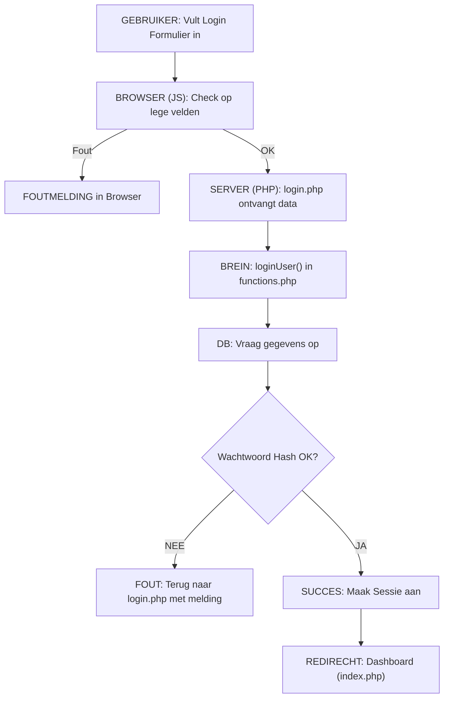
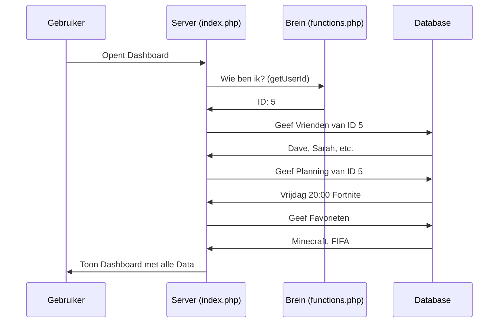
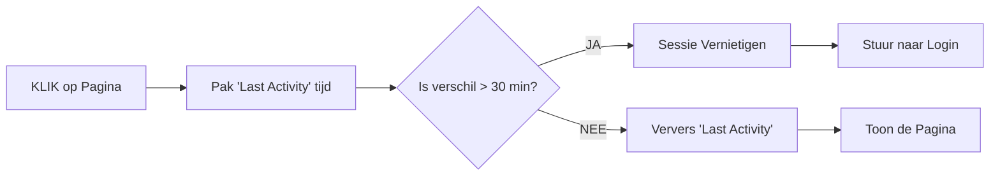

# 📊 CODE FLOW DIAGRAMMEN (Visueel)
## GamePlan Scheduler - Hoe de data door de site stroomt

In dit document zie je hoe een actie (zoals inloggen) van stap naar stap gaat.

---

### 1. Inlog Flow (Diagram)

---

### 2. Dashboard Pagina Laden (Data Verzamelen)

Wanneer je het dashboard opent, gebeurt er heel veel tegelijkertijd:

---

### 3. De 30-Minuten Check (Session Timeout)

---
**EINDE DIAGRAMMEN OVERZICHT**
