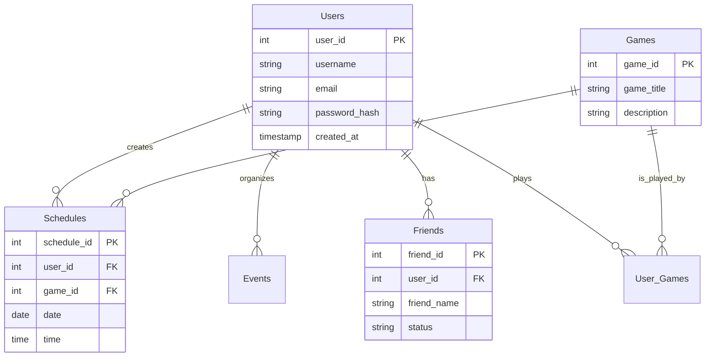

# 🗄️ DATABASE DOCUMENTATIE (NEDERLANDS)
## GamePlan Scheduler - Database Architectuur & ERD

---

> **Auteur**: Harsha Kanaparthi | **Examen**: MBO-4 Software Developer

---

# 1. ERD (Entity Relationship Diagram)



# 2. Tabel Definities

## 2.1 USERS
Deze tabel slaat de kerngegevens van de gebruikers op.
- **user_id**: Unieke sleutel (Primary Key).
- **username**: De publieke naam.
- **email**: Uniek veld voor inloggen.
- **password_hash**: Gehasht met **BCRYPT** (nooit plain text!).

## 2.2 GAMES
Slaat alle unieke spellen in het systeem op.
- **getOrCreateGameId()**: Deze logica zorgt dat we geen dubbele games in de tabel krijgen.

## 2.3 SCHEDULES
De relatie tussen een gebruiker, een spel en een tijdstip.
- **Foreign Keys**: Koppelt Gebruiker en Spel.

# 3. SQL Queries (Voorbeelden)

### Gebruiker Inloggen:
```sql
SELECT user_id, username, password_hash 
FROM Users 
WHERE email = :email AND deleted_at IS NULL;
```

### Dashboard Overzicht:
```sql
SELECT s.*, g.game_title 
FROM Schedules s 
JOIN Games g ON s.game_id = g.game_id 
WHERE s.user_id = :user_id 
ORDER BY s.date ASC;
```

---
**EINDE DATABASE DOCUMENTATIE**
