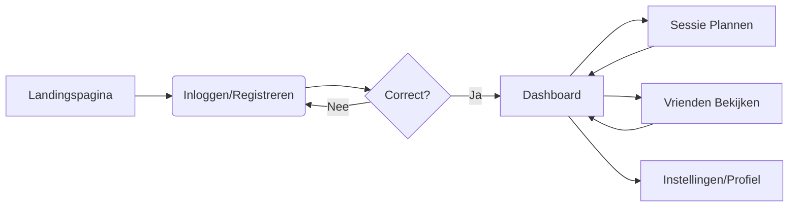

# 📋 FUNCTIONEEL ONTWERP (FO) - MASTER EDITIE
## GamePlan Scheduler - Gebruikerservaring, Functionaliteit & Visie

---

> **Auteur**: Harsha Kanaparthi | **Student**: 2195344 | **Project**: GamePlan Scheduler
> 
> "Dit document beschrijft de volledige functionele werking van de GamePlan Scheduler. Het vormt de brug tussen de wens van de gebruiker en de uiteindelijke technische realisatie. Voor een succesvol project is het essentieel om te begrijpen VOOR WIE we bouwen."

---

# 1. Project Visie & Doelstelling
De GamePlan Scheduler is ontstaan uit een frustratie die veel gamers delen: de versnippering van communicatie. Tussen Discord, WhatsApp en in-game chats raken afspraken vaak verloren. 

De **doelstelling** is het creëren van een rustpunt: een centrale, visueel aantrekkelijke webapplicatie waar de gamer de regisseur is van zijn eigen tijd. De kernwaarden van het product zijn:
1.  **Directheid**: Binnen drie klikken een sessie plannen.
2.  **Overzicht**: Alle sociale gaming-verplichtingen in één oogopslag.
3.  **Esthetiek**: Een design dat aansluit bij de moderne gaming-cultuur (Glassmorphism).

---

# 2. Uitgebreide Doelgroep Analyse (Personas)

### 👤 Persona A: "De Sociale Gamer" (Milan, 19 jaar)
- **Achtergrond**: Student, speelt veel multiplayer games zoals Valorant en League of Legends.
- **Probleem**: Moet altijd 10 mensen appen om een 'full party' te krijgen.
- **Behoefte**: Een overzichtelijke lijst van vrienden en een gedeelde agenda die niet vol staat met werk-afspraken.
- **Gebruik in App**: Gebruikt dagelijks de "Vrienden" en "Schedule" secties.

### 👤 Persona B: "De Completionist" (Sarah, 22 jaar)
- **Achtergrond**: Werkt fulltime, houdt van Single Player RPG's (The Witcher, Elden Ring).
- **Probleem**: Vergeet waar ze was gebleven in haar games door een drukke baan.
- **Behoefte**: Een plek om notities en voortgang bij te houden van haar 'Backlog'.
- **Gebruik in App**: Gebruikt vooral de "Favoriete Games" sectie met uitgebreide logs.

### 👤 Persona C: "De Toernooi-Organisator" (Kevin, 25 jaar)
- **Achtergrond**: Hobby-streamer en community manager.
- **Behoefte**: Wil externe evenementen (zoals Twitch streams of toernooien) koppelen aan zijn agenda.
- **Gebruik in App**: Gebruikt de "Events" functionaliteit om links naar streams op te slaan.

---

# 3. Use Cases (Interactie Modellen)

De applicatie ondersteunt de volgende primaire en secundaire handelingen:

### UC 1: Gebruikersbeheer & Veiligheid
- **Actoren**: Nieuwe of Bestaande Gebruiker.
- **Flow**:
    1.  Registratie met mail-uniekheidscheck.
    2.  Veilig inloggen via sessie-beheer.
    3.  Automatisch uitloggen bij inactiviteit (Privacy-bewust).

### UC 2: De "Perfecte Sessie" Plannen
- **Actoren**: Ingelogde gebruiker.
- **Stappen**:
    1.  Navigeer naar 'Add Schedule'.
    2.  Selecteer een Spel (Dankzij het automatische koppel-algoritme).
    3.  KIES Datum en Tijd (Beveiligd tegen datums in het verleden).
    4.  Voeg vrienden toe aan de omschrijving.
- **Resultaat**: De database koppelt de user_id aan de nieuwe record.

### UC 3: Vriendschappen Beheren
- **Actoren**: Gebruiker.
- **Actie**: Toevoegen van vrienden en het managen van hun status.
- **Logica**: Gebruikers kunnen hun sociale kring filteren en beheren zonder dat dit invloed heeft op andere gebruikers.

### UC 4: Backlog Management (Favorieten)
- **Actie**: Het markeren van games als favoriet en het toevoegen van voortgangs-notities.

---

# 4. Functionaliteiten Matrix (MoSCoW)

Om de scope van het examenproject te bewaken, is gebruik gemaakt van de MoSCoW methode:

| Categorie | Functionaliteit | Status |
|---|---|---|
| **Must have** | Gebruiker authenticatie (Login/Register) | ✅ Voltooid |
| **Must have** | Create/Read/Update/Delete van gaming afspraken | ✅ Voltooid |
| **Should have** | Vriendenbeheer & Status filters | ✅ Voltooid |
| **Should have** | Favoriete games overzicht met notities | ✅ Voltooid |
| **Could have** | Sorteren op datum (Oud/Nieuw) | ✅ Voltooid |
| **Could have** | 'External Events' integratie (Links/Herinneringen) | ✅ Voltooid |
| **Won't have** | Live Chat met WebSockets | ❌ Toekomst |

---

# 5. UX/UI Design Filosofie: Glassmorphism

De keuze voor **Glassmorphism** is niet willekeurig. Het is een designstijl die populair is in OS-interfaces van nieuwe gaming consoles (PS5 Dashboard, MacOS Sonoma).
- **Transparantie**: `backdrop-filter: blur()` creëert een gevoel van diepte.
- **Focus**: Door gebruik te maken van witte tekst op een donkere, geblurde achtergrond, gaat de aandacht direct naar de content.
- **Micro-interacties**: Hover-effecten op knoppen geven de gebruiker feedback dat het systeem 'leeft'.

---

# 6. Gebruikerspad (User Journey Map)

---

# 7. Conclusie

Dit Functioneel Ontwerp vormt de fundering van de GamePlan Scheduler. Door uit te gaan van echte gebruikersproblemen (via persona's) en een strakke scope (MoSCoW), is er een product ontstaan dat niet alleen technisch werkt, maar ook daadwerkelijk een probleem oplost voor de moderne gamer.

---
**GEAUTORISEERD VOOR EXAMENPORTFOLIO**
*Harsha Kanaparthi - 2026*
