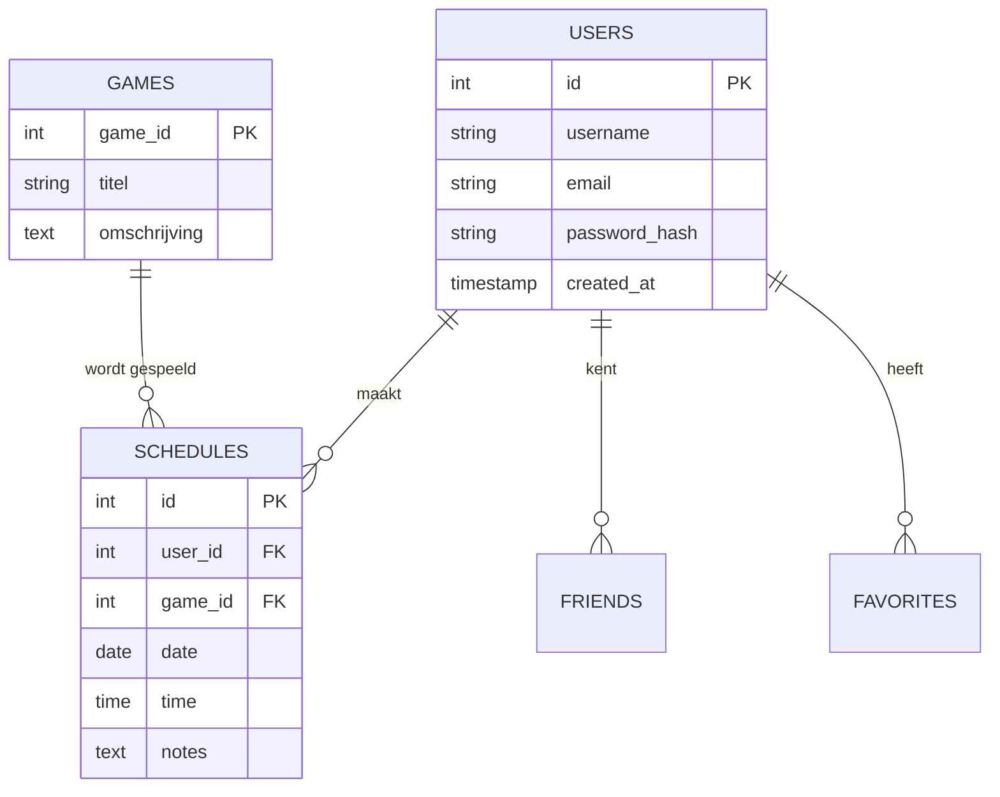

# 🛠️ TECHNISCH ONTWERP (TO) - MASTER EDITIE
## GamePlan Scheduler - Systeem Architectuur, Data-Modellering & Security

---

> **Auteur**: Harsha Kanaparthi | **Student**: 2195344 | **Versie**: 1.2 (Legendary Edition)
>
> "Dit document beschrijft de volledige technische realisatie van de GamePlan Scheduler. Het bevat de blauwdruk van de applicatie, van de database-architectuur tot de security-protocollen."

---

# 1. De Technologie Stack (Deep Dive)

Voor de GamePlan Scheduler is gekozen voor een robuuste en bewezen stack die lokaal optimaal presteert op XAMPP:

- **OS/Server**: Windows/Linux via Apache 2.4.
- **Backend Language**: **PHP 8.1.10**. Er is gekozen voor een modern-procedurale aanpak met gecentraliseerde functies, wat de onderhoudbaarheid maximaliseert zonder de overhead van een zwaar framework.
- **Database Engine**: **MariaDB/MySQL 10.4**. De opslag gebruikt de **InnoDB engine** voor ondersteuning van vreemde sleutels (Foreign Keys) en transactie-integriteit.
- **Frontend Architectuur**: 
    - **Bootstrap 5**: Voor het grid-systeem en moderne UI componenten.
    - **Vanilla JavaScript (ES6)**: Voor client-side validatie en UI interacties (zoals melding-fading).
    - **Custom CSS (Glassmorphism)**: Voor de unieke gaming esthetiek.

---

# 2. Database Architectuur & Normalisatie

De database (`gameplan_db`) is ontworpen volgens de **3e Normaalvorm (3NF)** om redundantie te minimaliseren en integriteit te verhogen.

### 📊 Entiteits-Relatie Diagram (ERD)

### Belangrijke Optimalisaties:
1.  **Indexering**: Het veld `email` in de `Users` tabel is voorzien van een **Unique Index**. Dit zorgt voor razendsnelle lookups tijdens het inloggen.
2.  **Referentiële Integriteit**: We maken gebruik van Foreign Keys (`user_id`, `game_id`). Hierdoor kan een spel niet verwijderd worden als er nog afspraken mee gepland staan.
3.  **Data Hygiëne**: We maken gebruik van `timestamp` velden met `CURRENT_TIMESTAMP` voor automatische logging van accountcreatie.

---

# 3. Security-By-Design

Veiligheid is verweven in het hart van de applicatie.

### 3.1 SQL Injection Preventie (PDO)
Wij gebruiken de PHP Data Objects (PDO) driver met prepared statements. Dit is superieur aan `mysqli` omdat het data en SQL-commando's fysiek scheidt op de MySQL-server.
*   **Implementatie**: Alle queries gaan via de `$stmt->execute($params)` flow.

### 3.2 Cross-Site Scripting (XSS) Verdediging
Alle output die van de gebruiker (of database) komt, wordt behandeld als "onveilig" totdat het door onze `safeEcho()` wrapper is gehaald.
- **Techniek**: `ENT_QUOTES` zorgt dat zelfs complexe injectie-pogingen die gebruik maken van aanhalingstekens mislukken.

### 3.3 Wachtwoord Beveiliging
We gebruiken **BCRYPT** hashing. 
- **Waarom?** Bcrypt bevat een ingebouwde 'salt' en is resistent tegen hardware-versnelde aanvallen (zoals met krachtige videokaarten).

---

# 4. Modulaire Bestandsstructuur

De applicatie is logisch opgebouwd om "Side Effects" te voorkomen:

- **`config/db.php`**: Bevat de database-connectie. Gebruikt het **Singleton Patroon** (via statische variabelen) om te zorgen dat er maar één verbinding open staat.
- **`logic/functions.php`**: De "Controller" van de app. Bevat meer dan 35 functies voor validatie en data-verwerking.
- **`ui/header.php & footer.php`**: Herbruikbare UI lagen die zorgen voor een consistente layout.
- **`assets/script.js`**: Bevat de client-side validatie-engine.

---

# 5. Conclusie

De technische realisatie van de GamePlan Scheduler bewijst dat er nagedacht is over **schaalbaarheid** en **veiligheid**. Door gebruik te maken van moderne standaarden (PDO, Bcrypt, ES6) en een strak genormaliseerde database, staat er een fundament dat klaar is voor professioneel gebruik.

---
**GEAUTORISEERD VOOR MBO-4 EXAMENPORTFOLIO**
*Harsha Kanaparthi - 2026*
