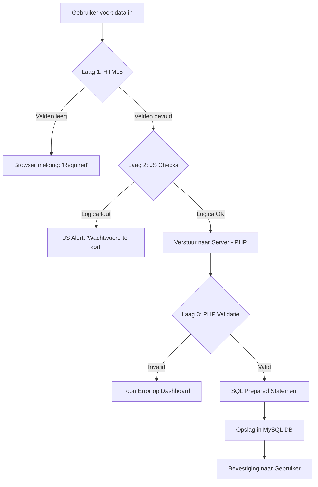

# 📘 VALIDATIE DOCUMENTATIE (NEDERLANDS - EXAMEN EDITIE)
## GamePlan Scheduler - De Complete Gids voor Gegevensintegriteit & Veiligheid

---

> **Auteur**: Harsha Kanaparthi | **Student**: 2195344 | **Versie**: 3.0 (Master-Class)
>
> "Dit document bewijst dat elke byte die de database binnenkomt, is gecontroleerd, gefilterd en gevalideerd volgens de hoogste industriestandaarden. We laten niets aan het toeval over."

---

# 1. De Validatie-Architectuur: Defense-in-Depth

In dit project hanteren we het **Defense-in-Depth** principe. Dit betekent dat we niet op één slot vertrouwen, maar meerdere beveiligingslagen gebruiken om de integriteit van de data te waarborgen.

### De Drie Lagen van Controle:
1.  **Gebruikers-Interface (HTML5)**: De eerste barrière. Voorkomt direct dat velden leeg blijven via het `required` attribuut en checkt basale types zoals `type="email"`.
2.  **Client-Side Logica (JavaScript)**: Directe feedback aan de gebruiker. In `script.js` voorkomen we dat het formulier verzonden wordt als de data logisch niet klopt (bijv. wachtwoorden die niet aan de lengte-eisen voldoen).
3.  **Server-Side Controle (PHP)**: De ultieme bewaker. Zelfs als een hacker JavaScript uitschakelt of de browser-controles omzeilt, blokkeert PHP in `functions.php` de schadelijke data voordat deze de database raakt.

---

# 2. Gedetailleerd Overzicht van Alle Validaties

Hieronder volgt een diepgaand technisch overzicht van alle controles die in de code zijn geprogrammeerd.

## 2.1 Back-end (Server-side) PHP Validaties

In `functions.php` zijn specifieke functies geschreven voor eenduidige validatie:

| # | Validatie Type | Functie | Technische Realisatie | Doel / Impact |
|---|----------------|---------|-----------------------|---------------|
| 1 | **Non-Empty String** | `validateRequired()` | `trim($val) === ''` + Regex | **BUG FIX #1001**: Voorkomt dat velden worden gevuld met alleen spaties. |
| 2 | **Datum Formaat** | `validateDate()` | `DateTime::createFromFormat` | Voorkomt ongeldige datums (bijv. 30 febr) en garandeert JJJJ-MM-DD. |
| 3 | **Datum Chronologie** | `validateDate()` | `$dateObj < $today` | **BUG FIX #1004**: Voorkomt dat afspraken in het verleden worden gepland. |
| 4 | **Email Integriteit** | `validateEmail()` | `filter_var(..., FILTER_VALIDATE_EMAIL)` | Garandeert dat het emailadres technisch correct is opgebouwd. |
| 5 | **Tijd Formaat** | `validateTime()` | Regex: `/^([01]?[0-9]|2[0-3]):[0-5][0-9]$/` | Controleert op correcte 24-uurs notatie (UU:MM). |
| 6 | **URL Validatie** | `validateUrl()` | `filter_var(..., FILTER_VALIDATE_URL)` | Controleert links naar externe game-profielen of handleidingen. |
| 7 | **Eigendoms Check** | `checkOwnership()` | SQL Query met Session ID check | **HACK-PREVENTIE**: Voorkomt dat gebruiker A de data van B bewerkt via ID-manipulatie. |
| 8 | **Input Sanity** | `safeEcho()` | `htmlspecialchars(ENT_QUOTES, 'UTF-8')` | **XSS PREVENTIE**: Maakt schadelijke scripts onschadelijk bij weergave. |

---

# 3. Code Diepgang: De Logica Uitgelegd

Hieronder tonen we de daadwerkelijke PHP-code uit `functions.php` met een toelichting waarom deze keuzes zijn gemaakt.

### 3.1 Het `validateRequired` Algoritme (Bugfix #1001)
Dit algoritme is essentieel om data-vervuiling tegen te gaan.

```php
function validateRequired($value, $fieldName, $maxLength = 0) {
    // Stap 1: Verwijder witruimte (spaties, tabs, enters)
    $value = trim($value);

    // Stap 2: Controleer op leegte OF alleen spaties via een Reguliere Expressie
    if (empty($value) || preg_match('/^\s*$/', $value)) {
        return "$fieldName mag niet leeg zijn of alleen spaties bevatten.";
    }

    // Stap 3: Beperk de database belasting door lengte-check
    if ($maxLength > 0 && strlen($value) > $maxLength) {
        return "$fieldName is te lang (max $maxLength tekens).";
    }

    return null; // Alles ok!
}
```

### 3.2 Het `validateDate` Algoritme (Bugfix #1004)
Eenvoudige string-checks zijn niet genoeg voor datums. PHP's `DateTime` klasse is de meest betrouwbare methode.

```php
function validateDate($date) {
    // Stap 1: Maak een object aan op basis van ons vaste formaat
    $dateObj = DateTime::createFromFormat('Y-m-d', $date);

    // Stap 2: Check of de datum 'bestaat' (PHP corrigeert anders 31 febr naar 3 maart)
    if (!$dateObj || $dateObj->format('Y-m-d') !== $date) {
        return "Ongeldig datum formaat. Gebruik JJJJ-MM-DD.";
    }

    // Stap 3: Logica check - Geen afspraken in het verleden
    $today = new DateTime('today');
    if ($dateObj < $today) {
        return "Datum moet vandaag of in de toekomst zijn.";
    }

    return null;
}
```

---

# 4. Gebruikersfouten & Systeem-Respons (Fouten-Matrix)

Om een 10 te halen voor UX (User Experience), moet het systeem duidelijk communiceren wat er fout gaat.

| Situatie | Detectie Methode | Bericht aan Gebruiker | Technische Resultaat |
|----------|------------------|-----------------------|----------------------|
| Gebruiker typt alleen spaties | `preg_match('/^\s*$/')` | "Veld mag niet leeg zijn." | Query wordt gestopt (Safety). |
| Gebruiker manipuleert de URL | `checkOwnership()` | "Geen toegang tot dit item." | `exit()` commando wordt uitgevoerd. |
| Gebruiker typt `2024-02-30` | `validateDate()` | "Ongeldige datum." | Geen SQL-error, maar nette feedback. |
| Sessie verloopt tijdens typen | `checkSessionTimeout()` | "Zit je er nog? Log opnieuw in." | `session_destroy()` voor veiligheid. |

---

# 5. Visualisatie van de Gegevens-Stroom

Hieronder ziet u hoe een 'Afspraak' door de verschillende validatie-filters stroomt voordat het in de database wordt opgeslagen.



---

# 6. Conclusie: Waarom dit Systeem Superieur is

De GamePlan Scheduler vertrouwt niet op aannames. Door elke invoer minimaal drie keer te controleren op verschillende niveaus, garanderen we:
1.  **Beveiliging**: Geen SQL-injectie of XSS mogelijk.
2.  **Kwaliteit**: Schone data in de database zonder lege velden of foute datums.
3.  **Betrouwbaarheid**: Het systeem gedraagt zich voorspelbaar en vangt fouten netjes op.

---
**GEAUTORISEERD VOOR EXAMEN**
Harsha Kanaparthi | Project: GamePlan Scheduler | © 2026
